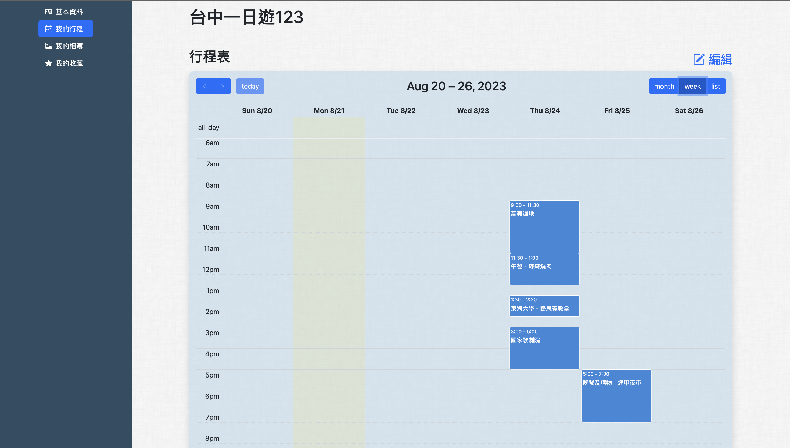
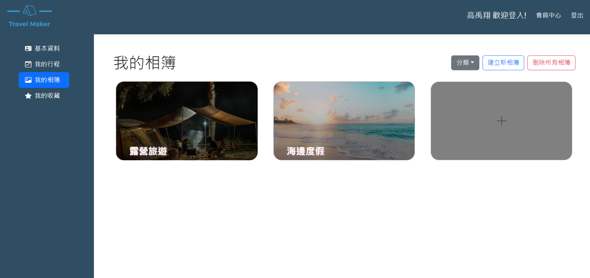

# TravelMaker
Travel Maker 讓行程安排輕鬆又便利

## 主要功能

### 1. 旅遊資訊
- 種類:帶你前往適合的新地方。
- 地區:方便查詢周遭景點。


### 2. 美食餐廳
餐廳頁面主要功能為前端網頁顯示資料庫內的餐廳資訊，以及透過JavaScript編寫的篩選功能。餐廳資訊會依卡片形式呈現，可以根據dropdown選單的checkbox，來分別針對"地區"及"類型"進行雙重複選功能，或是根據分類連結來進行篩選，並呈現篩選列印資料，搜尋結果頁面就會呈現出經過該條件篩選的內容。點擊卡片後進入餐廳內頁可以查看詳細資料，包含餐廳營業時間、地點、google map等資訊。


### 3. 會員系統

### 4. 行程助手
- 視覺化行程管理
- 彈性化行程內容
  - 行程備註
  - 活動圖片


### 5. 相簿分享
- 相簿內容增查修刪
- 依分類進行相簿篩選




## 使用技術


## 如何開始
因 laravel 專案內有`.gitignore` 有些文件需要手動重建, 依序執行以下步驟

### Step 1. Clone project 
```bash
git clone https://github.com/HappyPeppaTeam/TravelMaker.git
```

### Step 2. Rebuild package
重建被`.gitignore`忽略的package 
```bash
cd Backend
composer install
```

### Step 3. Generate Environment keys
重建 `.env` 檔
> .env.example 檔案更名為 .env

重建環境keys
```bash
php artisan key:generate
``` 
### Step 4. Check execution
點擊以下連結
http://localhost/TravelMaker/Backend/public/


## Git 操作指南

如何更新 branch 到最新進度

情境: Eric 剛剛 push 了最新進度到 branch `development` , Jeff 現在想要更新自己的 branch `Jeff_so_handsome` 到最新進度
### Step 0. Check local branch
確認是否有追蹤 `development` branch (local branch 中是否有 `development`) 

```bash
git branch
```

```
* Jeff_so_handsome
  development
  main
```

如果沒有 `development`, 複製與追蹤 `development` 分支
```bash
git checkout -b development origin/development
```

輸入方式如下
```bash
git checkout -b <new-local-branch-name> origin/<remote-branch-name>
```


### Step 1. Get lastest change
```bash
git checkout development
```

`pull` 最新進度
```bash
git pull
```

### Step 2. Update branch
```bash
git checkout Jeff_so_handsome
```
更新 `development` 進度到現在分支 `Jeff_so_handsome` 
```bash
git merge development
```


## Backup Database


### Google Cloud Shell
```bash
mysqldump -u root  -B [BackupDB_Name] -R -r [path/to/Backup_file_name.sql]
```

example
```bash
mysqldump -u root  -B AddressBook -R -r backup.sql
```

說明文件可以在 google clould shell `/home/happypeppa0401/DBbackup_guide.txt` 找到


### Mac
```bash
/Applications/XAMPP/bin/mysqldump -u root  -B [BackupDB_Name] -R -r [path/to/Backup_file_name.sql]
```

### Windows

```bash
C:\xampp\mysql\bin\mysqldump -u root  -B [BackupDB_Name] -R -r [path/to/Backup_file_name.sql]
```

